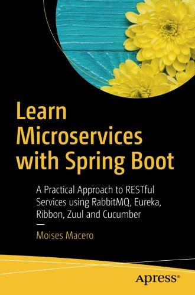
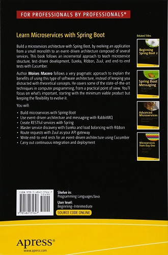

# Microservices - The Practical Way

[book sources](https://github.com/microservices-practical)

## About the book

Build a microservices architecture with Spring Boot, by evolving an application from a small monolith to an event-driven architecture composed of several services. This book follows an incremental approach to teach microservice structure, test-driven development, Eureka, Ribbon, Zuul, and end-to-end tests with Cucumber.

Author Moises Macero follows a very pragmatic approach to explain the benefits of using this type of software architecture, instead of keeping you distracted with theoretical concepts. He covers some of the state-of-the-art techniques in computer programming, from a practical point of view. You’ll focus on what's important, starting with the minimum viable product but keeping the flexibility to evolve it.

**What You'll Learn**

- Build microservices with Spring Boot
- Use event-driven architecture and messaging with RabbitMQ
- Create RESTful services with Spring
- Master service discovery with Eureka and load balancing with Ribbon
- Route requests with Zuul as your API gateway
- Write end-to-end rests for an event-driven architecture using Cucumber
- Carry out continuous integration and deployment

**Who This Book Is For**

Those with at least some prior experience with Java programming. Some prior exposure to Spring Boot recommended but not required.